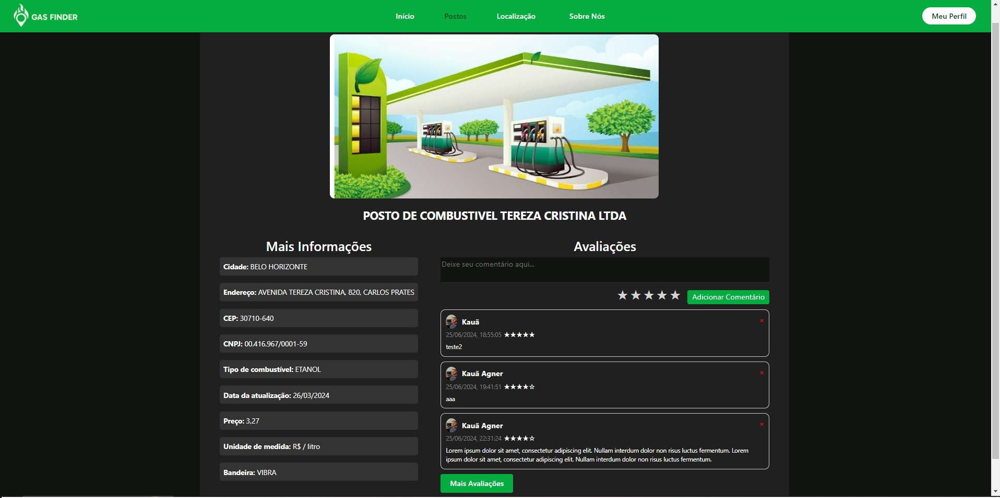

# Documentação do Projeto (TIDocs)

## Problema

O problema fundamental do trabalho é a dificuldade em encontrar postos de gasolina confiáveis durante um trajeto, ou próximos à residência do usuário. Por exemplo, quando você está dirigindo e não consegue olhar o preço do ccombustível em um posto na beira da via de locomoção ou também quando você quer saber se o local mais próximo da sua casa também é aquele com o melhor custo benefício.

## Objetivos

O objetivo do nosso trabalho é desenvolver uma Aplicação Web, a partir de ferramentas como o HTML e o CSS, de modo responsível, com o foco em:

1- Facilitar o processo de localização dos postos de gasolina.

2- Ajudar o usuário a verificar seu custo-benefício (tendo em vista o valor do combustível e sua qualidade, a partir de análises).

3- Traçar a rota mais próxima até o posto.

O nome (GasFinder) idealiza a função do nosso projeto (encontrar o melhor local para abastecer).

## Justificativa

Descreva a importância ou a motivação para trabalhar com esta aplicação que você escolheu. Indique as razões pelas quais você escolheu seus objetivos específicos ou as razões para aprofundar em certos aspectos do software.

O grupo de trabalho pode fazer uso de questionários, entrevistas e dados estatísticos, que podem ser apresentados, com o objetivo de esclarecer detalhes do problema que será abordado pelo grupo.

## Público-Alvo

O publico-alvo seriam todos os motoristas que estejam interessados em economizar dinheiro , ou encontrar o posto mais próximo, ou verificar a bandeira de um posto, ou verificar a rota até um posto.

## Personas

Relacione as personas identificadas no seu projeto e os respectivos mapas de empatia. Lembre-se que você deve ser enumerar e descrever precisamente e de forma personalizada todos os principais envolvidos com a solução almeja.

## Histórias de Usuários

Como um motorista de aplicativo, eu gostaria de encontrar postos de gasolina com um bom preço de combustível de forma mais prática para que eu possa obter mais lucro no fim do mês.

Como um caminhoneiro, eu quero localizar, com facilidade, postos de gasolina mais próximos, que tenham suporte e qualidade para abastecer meu veículo.

Como um corretor de imóveis, eu quero buscar de forma mais estratégica por postos de gasolina com a melhor geolocalização e com uma boa qualidade de combustível, para que eu possa economizar tempo durante o dia.

Como um motorista que usa o veículo diariamente, eu gostaria de saber mais sobre os postos de gasolina da minha cidade e fazer uma boa escolha com base nas informações e avaliações de cada.

## Requisitos

Os requisitos de um projeto são classificados em dois grupos:

- Requisitos funcionais- Tela principal dotada de cards com postos de gasolina (trazendo as informações), tela de cadastro, tela de avaliação do posto, tela de como chegar até o posto, tela de login, tela que mostra o posto em destaque, fitro dos postos na tela principal.7
  
- Requisitos não funcionais- Usabilidade fácil,possível de mudanças de acordo com a geolocalização, responsividade, adequado para uso de API, estética agradável da interface. 

## User Flow

A ideia inicial é que a nossa aplicação web só vai precisar de duas páginas, uma de login/cadastro e outra para mostrar os postos mais próximos, de maneira com que o usuário saiba a distância e as avaliações dele, mas também consiga avaliar a qualidade deles.

## Wireframes

 Base login

 base Cadastro

 Prototipo 2 Navegação

## Metodologia

O GasFinder foi totalmente trabalhado no SCRUM, contendo sprints que eram realizadas praticamente a cada três semanas. A primeira sprint foi realizada em grupo e contou, majoritariamente, com atividades de documentação (elicitação de requisitos funcionais e não funcionais, definição dos stakeholders, apresentação dos wireframes...). Enquanto isso as sprints dois e três foram realizadas individualmente, onde cada integrante do grupo enviava a sua parte do trabalho. Por fim, a sprint 4 foi em grupo e ilustrou a conclusão do trabalho, onde integramos as sprints que foram realizadas individualmente e realizamos uma apresentação na sala de aula mostrando as funcionalidades do site. 

## Funcionalidades

## Gestão de Projetos

O grupo está administrando as datas previstas por meio do site "Google agendas", onde pode criar um calendário comunitário com todos os membros inseridos.
A divisão de papeis da parte de programação será definida a partir dos avanços e das necessidades que o grupo for percebendo. 

## Link para o site hospeadado

https://icei-puc-minas-pmges-ti.github.io/pmg-es-2024-1-ti1-2010200-gas-finder/ 

## Referências Bibliográficas

Rosynni, S., Agner, K., Gontijo, L., Júnior, H., Nunes, P., Hanne, M., Professor, & Aramuni, J., Professor. (2024). GasFinder (Version 1.0.0) [Computer software]. https://github.com/ICEI-PUC-Minas-PMGES-TI/pmg-es-2024-1-ti1-2010200-gas-finder
